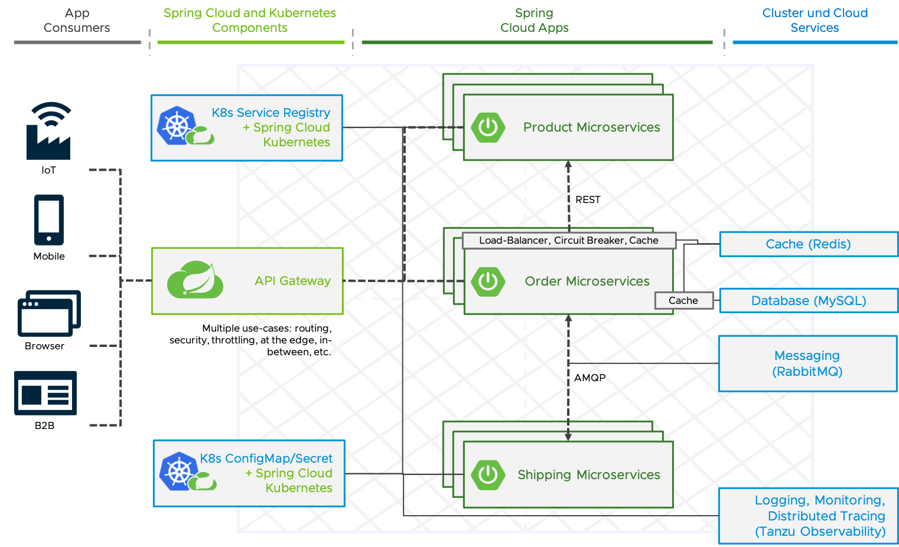

# Demo for a typical Spring Cloud Architecture on Kubernetes

[Presentation slides](building-a-typical-spring-cloud-architecture-application.pdf)

**See repository [here](https://github.com/tsalm-pivotal/spring-cloud-demo) for the same application deployed on TAS/PCF/CF**

**See repository [here](https://github.com/tsalm-pivotal/spring-cloud-demo-asc) for the same application deployed on Azure Spring Cloud**



## Deployment

1. Ensure you have a local Docker installed and running, then execute:
   ```
   docker login # If you are not using Docker Hub you have to specify the host of the registry 
   ./build-and-push-containers.sh <your-registry-prefix> # If you are using Docker Hub as a registry the prefix is just your Docker Hub ID
   ```
2. Create private registry secret resource
   ```
   kubectl create secret docker-registry regcred --docker-server=https://index.docker.io/v1/ --docker-username=<your-name> --docker-password=<your-pword> --docker-email=<your-email>
   ```
3. Pods with the spring-cloud-kubernetes dependency requires access to the Kubernetes API. 
   See information [here](https://docs.spring.io/spring-cloud-kubernetes/docs/current/reference/html/#service-account) and change/delete the [k8s-deployment/rbac.yaml](k8s-deployment/rbac.yaml) based on your requirements.       
4. (Optional) For the distributed tracing with Spring Cloud Sleuth and [VMware Tanzu Observability by Wavefront](https://tanzu.vmware.com/observability) you have to specify a Wavefront instance uri and api-token here [/k8s-deployment/wavefront-secret.yaml](/k8s-deployment/wavefront-secret.yaml).
   Because the values are stored in a Kubernetes Secret, they have to be Base64 encoded. You can do this for example with your terminal by executing `echo "my-api-token" | base64`.
   By default, the Wavefront Spring Boot Starter creates a Freemium account without a registration for you. See more details [here](https://docs.wavefront.com/wavefront_springboot.html) on how to get the credentials.
5. Create all required Kubernetes resources
    ```
    kubectl create -f k8s-deployment
    ```
***Hint:** For a more production-ready deployment of the data and messaging services, operators/helm charts like the [OSS RabbitMQ operator](https://www.rabbitmq.com/kubernetes/operator/quickstart-operator.html) or the ones available at the [Bitnami community catalog](https://bitnami.com/stacks/helm) are recommended instead of the container image deployments in  the k8s-deployment dir.*


## API usage 

Set the host name of the `sc-gateway-service`. If service type LoadBalancer is supported in your cluster with
```
GATEWAY_HOST_NAME=$(kubectl get service sc-gateway-service -ojsonpath='{.status.loadBalancer.ingress[0].hostname}')
```
otherwise with 
```
GATEWAY_HOST_NAME=$(kubectl get service sc-gateway-service -ojsonpath='{.spec.clusterIP}')
```
 
- Fetch products:
	```
	curl http://${GATEWAY_HOST_NAME}/sc-product-service-service/api/v1/products
	```
- Fetch orders:
	```
	curl http://${GATEWAY_HOST_NAME}/sc-order-service-service/api/v1/orders
	```
- Create order (After 10 seconds the status of the order should be DELIVERED)
	```
	curl --header "Content-Type: application/json" --request POST \
	  --data '{"productId":1,"shippingAddress":"Test address"}' \
	  http://${GATEWAY_HOST_NAME}/sc-order-service-service/api/v1/orders
	```
 
The Spring Cloud Kubernetes Config project makes Kubernetes ConfigMap instances available during application bootstrapping and triggers hot reloading of beans or Spring context when changes are detected on observed ConfigMap instances.
To demonstrate this functionality, fetch the products, change the product names in the sc-product-service configmap (k8s-deployment/product-service-configmap.yaml) and fetch the products again.